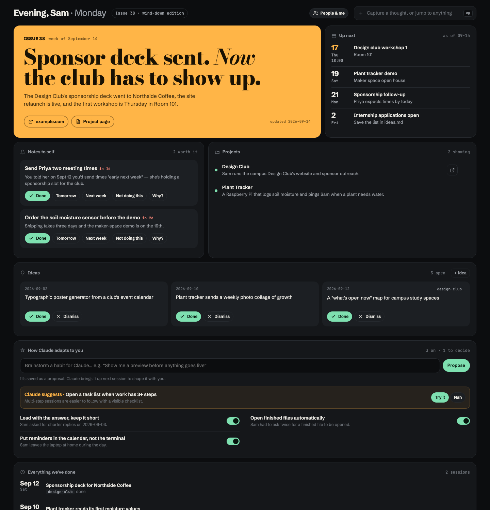
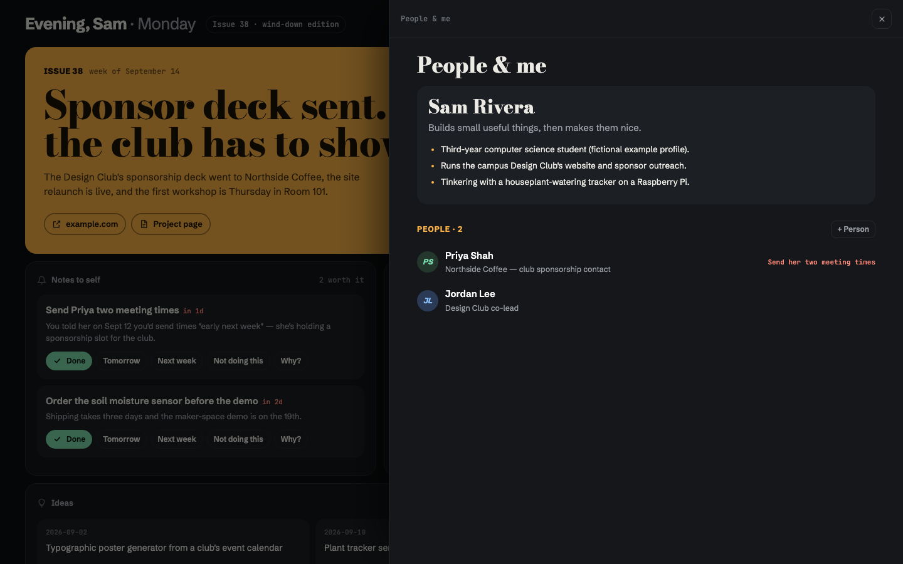

# brain

A personal "digital brain" for working with [Claude Code](https://claude.com/claude-code): a folder of plain
markdown notes that Claude reads instead of re-deriving context every session, plus a small local app to browse and
act on them.



- **Cover story:** Claude writes a magazine-style headline about your week after real work.
- **Notes to self:** reminders Claude adds only when they help. You can mark them Done (with confetti), snooze them, or say "Not doing this", which retires them for good.
- **Projects:** hide the ones you're not working on; they wait under "Show hidden".
- **How Claude adapts to you:** habits Claude follows every session. Claude can *propose* a new one, and you switch each on or off. You can also brainstorm a habit in the app, and Claude talks it through with you next session. Past habits stay out of the way.
- **⌘K capture:** type a thought, idea, to-do or person. Claude files it into the right note next session.
- **Ideas board:** mark ideas done or dismiss them.
- **Edit in place:** every note, person and project page opens in a side panel with a live markdown preview. ⌘S saves the file.
- **Reopen anything:** copy the command to resume a past Claude Code chat, open a project in VS Code, or open its live site.
- **Everything we've done:** one self-contained note per session, in a full-width timeline.
- **People & me:** your profile and contacts, one click away but out of the main view.

Everything is plain markdown on your machine. The app is ~1 Python file plus ~1 HTML file, uses only the standard
library, and has no build step.



## Try it (30 seconds)

```bash
git clone https://github.com/zacfink/brain.git
cd brain
python3 app/server.py --notes example      # opens http://127.0.0.1:4747
```

`example/` is a fictional student's notes. Requires Python 3.9+.

## Use it for real

The brain folder lives *inside* your notes folder as `.brain/`, so the app finds your notes as its parent:

```bash
mkdir -p ~/Notes && git clone https://github.com/zacfink/brain.git ~/Notes/.brain
ln -s ~/Notes/.brain/bin/brain ~/.local/bin/brain    # any folder on your PATH
brain                                                # start + open;  brain stop / restart / log
```

Start your notes from the shapes in [`FORMATS.md`](FORMATS.md). You can also copy `example/` and edit it, or just ask
Claude Code to draft them from your projects, calendar and email. `BRAIN_NOTES=/some/folder brain` points the app
somewhere else.

### Connect Claude Code

1. **Session-start hook** tells Claude your active habits and any inbox captures. It adds a few hundred tokens and makes no model call.
   Add to `~/.claude/settings.json`:
   ```json
   "hooks": {
     "SessionStart": [{ "hooks": [{ "type": "command", "command": "python3 ~/Notes/.brain/session_start.py 2>/dev/null || true", "timeout": 5 }] }]
   }
   ```
2. **Instructions** in your `CLAUDE.md` or Claude's memory, for example:
   > `~/Notes` is my brain. Before project work, read `~/Notes/INDEX.md` and the project page. File any inbox
   > captures into the right note. Follow `on` habits in `claude/habits.md`, and propose (never enable) new ones.
   > Add nudges to `nudges.md` only when they clearly help me, and never re-add one marked `no`. After real work,
   > write a session note (`.brain/session-template.md`), update the project page and `now.md`, then run
   > `python3 ~/Notes/.brain/build.py`.

## How it fits together

```
~/Notes/                      your notes (keep private)
├── INDEX.md                  generated table of contents — Claude reads this first
├── me.md  now.md  nudges.md  ideas.md  inbox.md
├── claude/habits.md
├── projects/<slug>.md        current truth per project
├── people/<slug>.md
├── sessions/YYYY-MM-DD-*.md  one note per Claude Code session (history)
└── .brain/                   this repo
    ├── app/server.py         stdlib HTTP server: reads/writes the notes, serves the app
    ├── app/index.html        the whole UI (vanilla JS, no build)
    ├── build.py              regenerates INDEX.md
    ├── session_start.py      Claude Code SessionStart hook
    ├── bin/brain             launcher
    ├── FORMATS.md            file shapes the app parses
    └── example/              fictional notes to try it with
```

**Why markdown files instead of a database?** Claude reads and edits them with the tools it already has. Opening
a file costs nothing until it's needed, and you stay in control of your own data.

## Security

The server binds to `127.0.0.1` only. Every API call needs a random per-run token embedded in the page, and requests
whose `Host` isn't local are rejected, which blocks DNS rebinding. Reads and writes are limited to `.md` files inside
the notes folder, never dot-folders. Saves detect edits made on disk since you opened a file, so you won't
overwrite Claude's changes.

Your notes folder will likely hold contacts and personal details. Keep it out of public repos.

## Notes

Tested on macOS with Chrome and Safari. Fonts load from Google Fonts, with system fallbacks when offline. Resume
buttons read session ids from `~/.claude/projects`.

## License

[MIT](LICENSE)
