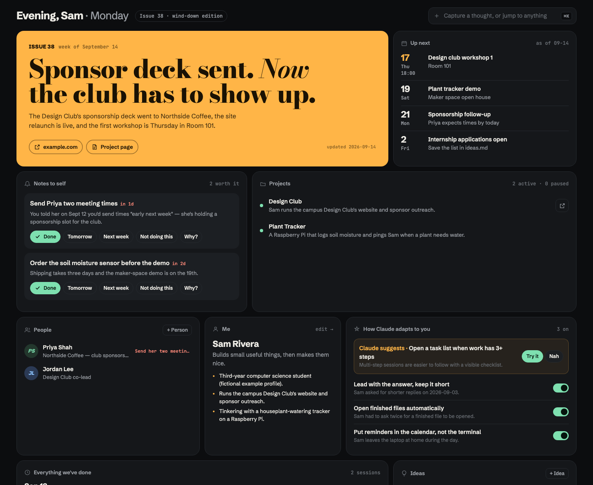
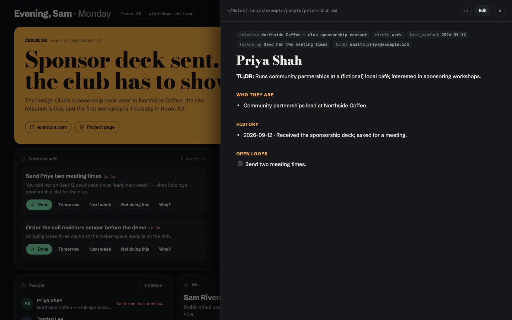

# brain

[](https://github.com/zacfink/brain/actions/workflows/tests.yml)

A personal "digital brain" for working with [Claude Code](https://claude.com/claude-code): a folder of plain
markdown notes that Claude reads instead of re-deriving context every session, plus a small local app to browse and
act on them.



- **Cover story:** Claude writes a magazine-style headline about your week after real work.
- **Notes to self:** reminders Claude adds only when they help. You can mark them Done (with confetti), snooze them, or say "Not doing this", which retires them for good.
- **Projects:** hide the ones you're not working on; they wait under "Show hidden".
- **How Claude adapts to you:** habits Claude follows every session. Claude can *propose* a new one, and you switch each on or off. You can also brainstorm a habit in the app, and Claude talks it through with you next session. Past habits stay out of the way.
- **⌘K capture:** type a thought, idea, to-do or person. Claude files it into the right note next session.
- **Ideas board:** mark ideas done or dismiss them.
- **Edit in place:** every note, person and project page opens in a side panel with a live markdown preview. ⌘S saves the file.
- **Reopen anything:** copy the command to resume a past Claude Code chat, open a project in VS Code, or open its live site.
- **Map of everything:** if you've run graphify (the Claude Code skill) on your notes (`graphify-out/graph.json`), a Map tile draws the knowledge graph in the app's colours. Hover a dot to see its links, click to open its note, use the legend to focus one cluster, or search it: type a few letters and it suggests matching ideas and clusters, then flies to the one you pick.
- **Light and dark:** two matte themes, Pro Black and Frost, that follow your system until you pick one: the chip in the desktop top bar, or **Settings → Dark mode** on the phone. Each device keeps its own choice.
- **Everything we've done:** one self-contained note per session, in a full-width timeline.
- **People & me:** your profile and contacts, one click away but out of the main view.
- **On your phone:** a home-screen app with the cover, Up next, Notes to self, projects, ideas, habits and capture. It works with your laptop off, using a private GitHub repo as the backend. [Set it up →](#on-your-phone)
- **Background agents:** anything you capture can start a headless Claude Code agent that files it or does it. [More →](#background-agents-optional)
- **Stats:** prompts sent, sessions, subagents, tool calls, tokens and storage, with 30-day charts, read straight from Claude Code's transcripts.
- **How well Claude knows you:** Claude logs each bet it makes about what you'll want (a recommended option, a guess, a draft), and Brain scores its calibration.
- **Jev (optional):** with a [TypeSafe](https://typesafe.ai) key, Jev files phone captures it's sure about, and gives a second opinion on Claude's bets. [More →](#jev-optional)

Everything is plain markdown on your machine. The app is a few small Python files plus one HTML file, uses only the
standard library, has no build step, and runs on macOS, Windows and Linux.



## How I actually use it

I've run every Claude Code session through this since May 2026: 49 sessions across 13 projects, with 15 habits Claude
follows on every session. A few things it has shipped:

- **[qweb.dev](https://qweb.dev)**, the 2026 site for Queen's Web Development Club, which I co-chair: rebuilt in
  React + Supabase and shipped through PRs.
- **[zacfinkelstein.ca](https://zacfinkelstein.ca)**, my portfolio.
- The weekly admin of a full course load: syllabi into my calendar, lab prep, reminders.

The habits are the part I'd copy. Each one exists because something went wrong once. For example, I brought Claude a
popular "LLM council" skill (11 subagents per question). It argued me out of it: same model, fake independence, and
10–20× the tokens for an answer I can get by asking. That argument became a habit: **when I pitch a project, Claude
argues against it first.**

### My setup

**The 16 habits Claude follows every session** (from `claude/habits.md`; each started as something that went wrong once):

| How we talk | How Claude works | What Claude never does |
|---|---|---|
| Lead with the answer, keep it short | Read the brain first, write it back after | Invent facts about my club; real content only |
| Pitch one practical thing, then move far | Check my notes before trawling email and calendar | Relitigate a decision I've already made |
| Argue against a new project idea before building it | Open a task list when work has 3+ steps | Reach me through the terminal (it's the calendar; my laptop stays home) |
| Let me pick more than one answer | Check both calendars before proposing times | Trust a branch other than `main` on the club site |
| Interested, not eager, in outreach | Open finished files for me, and commit + push notes after updating them | Treat an iCloud-synced Desktop like a normal folder |

**Skills I wrote:**
- [`/wild`](skills/wild/SKILL.md): the one exception to "argue first". When I say "go wild", Claude generates 40+ ideas across 8
  forced angles (absurd scale, wrong medium, flip the user, collide my projects, cog sci, startup-in-10-days,
  anti-idea, pure bit), pushes the 5 strangest further, then lands on exactly two: one doable this month and one pure
  fun. Tested against a no-skill baseline: 12 sensible ideas became 45 across every angle, 7 of them physical.
  **Make your own:** paste this into Claude Code and it builds a `/wild` around your projects, your field and your
  constraints, then test-runs it on one of your projects:

  ```text
  Make me a personal /wild skill for Claude Code: a mode I trigger by saying "go wild" that floods me with over-the-top ideas, then lands on the two worth doing.

  Use https://github.com/zacfink/brain/blob/main/skills/wild/SKILL.md as the template. Keep its shape exactly: the flood (40+ one-line ideas under forced lenses, at least 4 per lens), mutate (push the 5 strangest one level further), land it (exactly two picks: "wild but doable this month" with a first step, and "pure fun"), then stop. Keep its common-mistakes table.

  Personalize it to me:
  1. First look for context about me: a CLAUDE.md, a notes folder (like ~/Notes/INDEX.md), my repos. Then ask me at most 3 short questions to fill gaps: my projects, what I study or work on, and my real constraints (time, money, gear, where I usually am).
  2. Rewrite the "Collide projects" lens with my actual projects, and the "Cog sci mode" lens as the deep field I care about (swap it for mine, e.g. economics, biology, music).
  3. Replace one lens with one invented for me. For a designer that might be "make it ugly on purpose"; for a founder, "sell it to your harshest customer".
  4. Rewrite the Grounding section to point at wherever my context actually lives.
  5. Update the description's trigger phrases to include how I'd naturally ask.

  Save it to ~/.claude/skills/wild/SKILL.md. Then test it: run it once on one of my real projects and show me the result, so I can see it works before I rely on it.
  ```

**What I build on:** [Superpowers](https://github.com/obra/superpowers) (brainstorm, then spec, then plan, then
test-first for anything real), [graphify](https://github.com/safishamsi/graphify) (the Map), and the impeccable
design plugin for UI work. Brain is the glue: it's where the habits, the specs and every session's outcome live.

## Try it (30 seconds)

```bash
git clone https://github.com/zacfink/brain.git
cd brain
python3 app/server.py --notes example      # opens http://127.0.0.1:4747  (Windows: py app\server.py --notes example)
```

`example/` is a fictional student's notes. Requires Python 3.9+ and nothing else.

## Use it for real

The brain folder lives *inside* your notes folder as `.brain/`, so the app finds your notes as its parent:

```bash
mkdir -p ~/Notes && git clone https://github.com/zacfink/brain.git ~/Notes/.brain
ln -s ~/Notes/.brain/bin/brain ~/.local/bin/brain    # any folder on your PATH
brain                                                # start + open;  brain stop / restart / log
```

**Windows:** clone into `%USERPROFILE%\Notes\.brain` and run `%USERPROFILE%\Notes\.brain\bin\brain.cmd` (or add
`bin` to your PATH and run `brain`). It opens your browser; close the window to stop it.

Start your notes from the shapes in [`FORMATS.md`](FORMATS.md). You can also copy `example/` and edit it, or just ask
Claude Code to draft them from your projects, calendar and email. `BRAIN_NOTES=/some/folder brain` points the app
somewhere else.

### Connect Claude Code

1. **Session-start hook** tells Claude your active habits and any inbox captures. It adds a few hundred tokens and makes no model call.
   Add to `~/.claude/settings.json`:
   ```json
   "hooks": {
     "SessionStart": [{ "hooks": [{ "type": "command", "command": "python3 ~/Notes/.brain/session_start.py 2>/dev/null || true", "timeout": 5 }] }]
   }
   ```
   On Windows, use `python` instead of `python3` (Claude Code runs hooks through Git Bash, so the rest works as is).
2. **Instructions** in your `CLAUDE.md` or Claude's memory, for example:
   > `~/Notes` is my brain. Before project work, read `~/Notes/INDEX.md` and the project page. File any inbox
   > captures into the right note. Follow `on` habits in `claude/habits.md`, and propose (never enable) new ones.
   > Add nudges to `nudges.md` only when they clearly help me, and never re-add one marked `no`. After real work,
   > write a session note (`.brain/session-template.md`), update the project page and `now.md`, then run
   > `python3 ~/Notes/.brain/build.py`.

### Connect Codex

Codex has no session-start hook, but it reads `~/.codex/AGENTS.md` at the start of every session. Run this once:

```bash
python3 ~/Notes/.brain/codex.py
```

It adds a marked **Brain** block to that file with the standing instructions (read `INDEX.md` first, follow the `on`
habits, file inbox captures, write a session note) plus the current habits and inbox. Brain refreshes the block every
time it rebuilds `INDEX.md`, and anything else in the file is left alone. To have [background
agents](#background-agents-optional) run through Codex instead of Claude, start Brain with `BRAIN_AGENT=codex brain`.
They use `codex exec` in a `workspace-write` sandbox: your notes and `~/Projects`, no network.

**Windows:** run `py %USERPROFILE%\Notes\.brain\codex.py` once, then start Brain with Codex agents from a Command
Prompt with `set BRAIN_AGENT=codex` followed by `%USERPROFILE%\Notes\.brain\bin\brain.cmd` (PowerShell:
`$env:BRAIN_AGENT="codex"`). Log in to Codex first (`codex login`), since background agents can't answer a login prompt.

## How it fits together

```
~/Notes/                      your notes (keep private)
├── INDEX.md                  generated table of contents — Claude reads this first
├── me.md  now.md  nudges.md  ideas.md  inbox.md
├── claude/habits.md
├── projects/<slug>.md        current truth per project
├── people/<slug>.md
├── sessions/YYYY-MM-DD-*.md  one note per Claude Code session (history)
├── agents/                   optional: turns on background agents; one log file per run
├── phone/                    optional: turns on the phone app (queue/ + state.json)
└── .brain/                   this repo
    ├── app/server.py         stdlib HTTP server: reads/writes the notes, serves the app
    ├── app/index.html        the whole UI (vanilla JS, no build)
    ├── app/theme.css         colours and light/dark themes, shared with the phone app
    ├── app/agents.py         background agent runner (queue, one at a time, status files)
    ├── app/sync.py           git pull/commit/push for the phone app
    ├── app/phone.py          applies phone actions on GitHub, writes phone/state.json
    ├── app/jev.py            optional Jev calls: filing phone captures, the bet check
    ├── mobile/               the phone app (served from GitHub Pages)
    ├── build.py              regenerates INDEX.md
    ├── session_start.py      Claude Code SessionStart hook
    ├── codex.py              Codex adapter: keeps a brain block in ~/.codex/AGENTS.md
    ├── bin/brain, brain.cmd  launchers (macOS/Linux, Windows)
    ├── FORMATS.md            file shapes the app parses
    ├── example/              fictional notes to try it with
    └── tests/                unit tests, run on every push by GitHub Actions
```

**Why markdown files instead of a database?** Claude reads and edits them with the tools it already has. Opening
a file costs nothing until it's needed, and you stay in control of your own data.

## Background agents (optional)

Create an `agents/` folder in your notes and anything you capture in the app (a note, idea, todo, person or habit
proposal) also starts a headless Claude Code agent (`claude -p`). It files the thought where it belongs, or does the
task, writes a short report and exits. Runs go one at a time with a 20-minute limit, and a small "agents" chip in the
top bar turns amber while one is working. Click it for the reports.

The agent's permissions are an allowlist, not a denylist. It runs with `--setting-sources project --permission-mode
dontAsk`, so your own Claude settings can't widen it and anything off the list is refused. It can read, edit notes and
project files, search the web, create Gmail drafts and add calendar events. It can't send email or texts, commit,
push or run arbitrary shell commands. Outward actions come back as drafts for you to send.

Each run writes `agents/<time>-<slug>.md` (queued, running, then done or failed), so the state survives a restart. The
runner's tests use a fake `claude`, so they're free: `python3 -m unittest discover -s tests`.

## On your phone


A home-screen app for the parts you use on the go: the cover story, Up next, Notes to self (Done / Tomorrow / Next
week / Drop), projects (tap to read), ideas, Claude's habits and **Capture**. It works with your laptop closed.

**How:** your notes live in a private GitHub repo, and that repo is the backend. The phone never edits a note
itself. Each tap drops a tiny file into `phone/queue/`, and a GitHub Action applies it with the same Python code the
desktop app uses (so the two can't disagree), then rebuilds `phone/state.json`, the summary the phone reads. That
takes about 30 seconds, and the phone shows your change straight away in the meantime. A capture from your phone
gets its background agent the next time your laptop pulls.

On your laptop, Brain pulls from GitHub when it starts, when you reload the page and when a Claude session starts.
It commits and pushes only the notes it changed itself. If the phone and laptop ever change the same note in a way
git can't combine, it stops and says "Sync paused" instead of guessing.

**Set it up (about 10 minutes):**

1. **Put your notes in a private GitHub repo** (`~/Notes` with `.brain/` in its `.gitignore`) and push it.
2. **Add the Action:** copy [`docs/notes-workflow.yml`](docs/notes-workflow.yml) to `.github/workflows/brain.yml`
   in the notes repo, create `phone/queue/.gitkeep`, then commit and push. Its first run creates `phone/state.json`.
3. **Make a key for your phone:** github.com → your avatar → **Settings → Developer settings → Personal access
   tokens → Fine-grained tokens → Generate new token**.
   - **Repository access:** *Only select repositories* → your notes repo.
   - **Permissions:** the page lists every permission a key could have, which is normal. Under **Repository
     permissions**, set **Contents** to **Read and write**. Leave everything else at *No access*. GitHub sets
     *Metadata* to read-only on its own. (Newer GitHub shows an **Add permissions** button instead: add *Contents*,
     then choose *Read and write*.)
   - The summary should read "Read access to metadata" and "Read and Write access to code". Generate it and copy
     the `github_pat_…` key.
4. **Install the app:** on your phone, open **https://zacfink.github.io/brain/mobile/** in Safari (or Chrome on
   Android) → Share → **Add to Home Screen**. Open it, tap **Connect**, enter `your-name/notes` and paste the key.

The key stays on your phone only. The app's code is public and holds no notes. You can revoke the key on GitHub
anytime.
<br clear="right">

## Jev (optional)

[Jev](https://docs.typesafe.ai) is TypeSafe's small judgment model: it answers typed questions with probabilities
instead of writing text. Brain calls it over plain HTTP (no SDK) only when `TYPESAFE_API_KEY` is set, and does
exactly what it did before when it isn't.

- **Filing phone captures.** When the notes Action applies a phone capture, Jev picks where it belongs from your real
  projects and people. If it's at least 70% sure, code files it: an idea goes into `ideas.md` with `(project: slug)`, a
  todo becomes a `- [ ]` line under that project's **Open threads**, and a person note becomes a dated line under their
  **History**. Notes, and anything Jev isn't sure of, go to the inbox for Claude as before. Add the key as a
  `TYPESAFE_API_KEY` repository secret in your notes repo (the workflow already passes it through).
- **A second opinion on Claude's bets.** `brain jev-bet "<bet>" [recommend|guess|draft|habit]` reads your past bets
  in `claude/predictions.md` and prints Jev's chance you'll go along. Claude logs it at the end of the prediction line
  (`· jev: 40%`), and the "knows you" panel scores Jev and Claude on the same bets.

## Security

The server binds to `127.0.0.1` only. Every API call needs a random per-run token embedded in the page, and requests
whose `Host` isn't local are rejected, which blocks DNS rebinding. Reads and writes are limited to `.md` files inside
the notes folder, never dot-folders. Saves detect edits made on disk since you opened a file, so you won't
overwrite Claude's changes.

Your notes folder will likely hold contacts and personal details. Keep it out of public repos, and keep the notes
repo private if you use the phone app. The phone's key can reach only that one repo.

## Notes

The tests run on macOS, Windows and Linux on every push. The app is used daily on macOS with Chrome and Safari. Fonts load from Google Fonts, with system fallbacks when offline. Resume
buttons read session ids from `~/.claude/projects`.

## License

[MIT](LICENSE)
